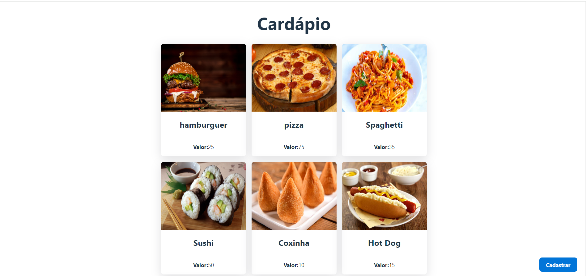
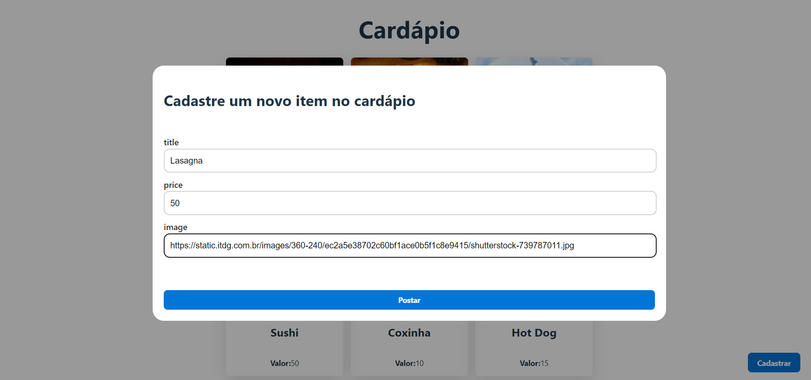
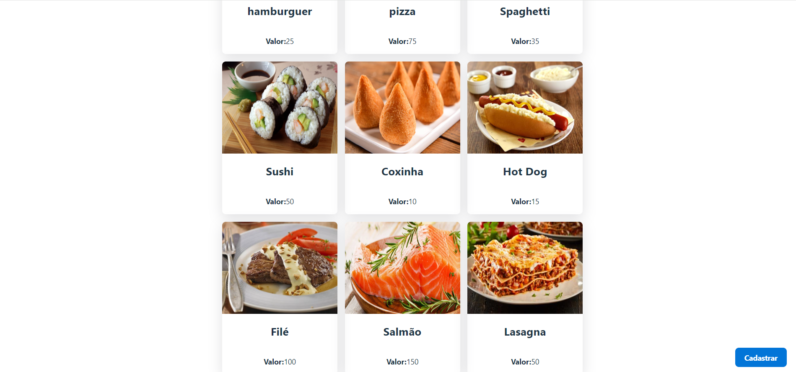

# Menu application

A Spring Boot + React application created following a YouTube tutorial

The main objective of following this tutorial was to learn how to use React to consume a REST API built with Spring

I am now trying to dockerize this application so it will be easier to run

## Menu screen

## New item form

After clicking the "Cadastrar" button, a pop-up form will appear and ask the user to provide informations about the new item

## Registered item

After clickking "Postar", the new item is registered and we can see it in the menu

## Endpoints:

| method | endpoint | what it does? |
|--------|----------|---------------|
| GET | /food | returns all registered foods |
| POST | /food | register a food using title, image and price info given in body |

## YouTube Tutorial from Fernanda Kipper:

- [Part 1 (backend)](https://www.youtube.com/watch?v=lUVureR5GqI)
- [Part 2 (frontend)](https://www.youtube.com/watch?v=WHruc3_2z68&t=1252s)